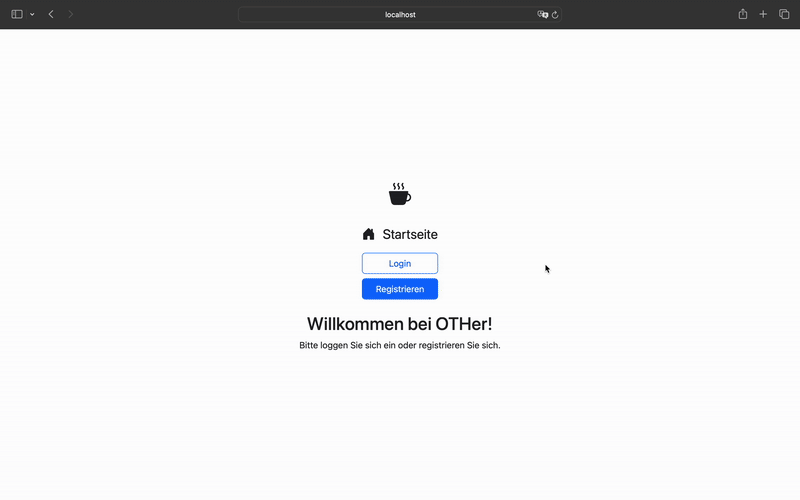
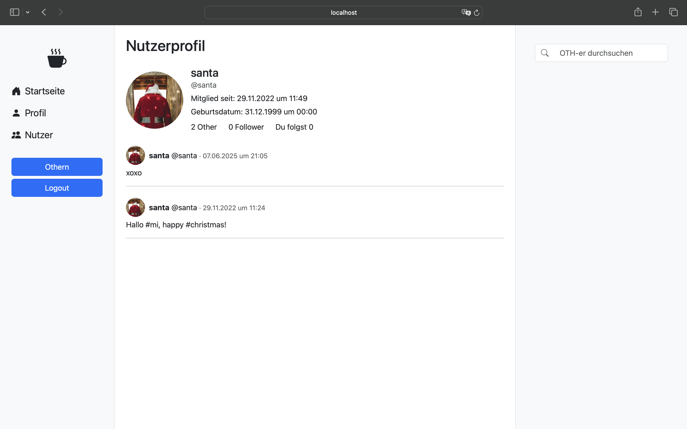
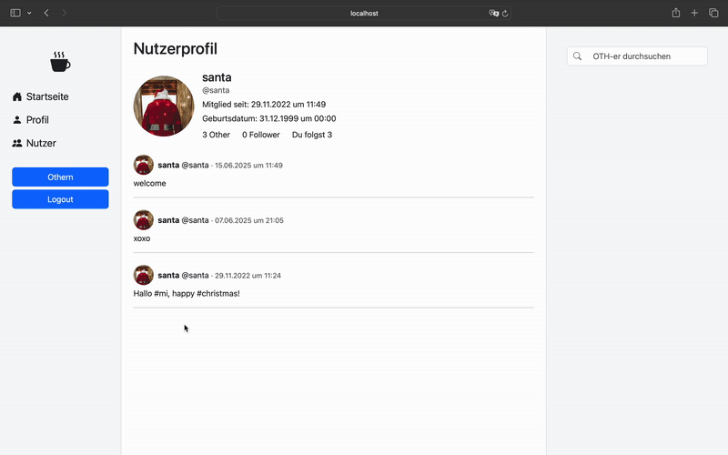

# OTHer – Microblogging Platform

**OTHer** is a minimalist microblogging app inspired by Twitter, built as part of my university coursework. It allows users to post short messages, follow others, explore trending hashtags, and search for profiles.

> **Note:** This is a *showcase repository only*. The full source code is part of a private GitHub Classroom assignment and cannot be publicly shared.

---

## Features

- Post short messages ("OTHer")
- Follow and unfollow other users
- Real-time list of trending hashtags
- User search and profile viewing
- Responsive design using Bootstrap

---

## Technologies Used

- **Backend:** Node.js, Express
- **Database:** PostgreSQL
- **Frontend:** Handlebars (template engine), Bootstrap

---

## Screenshots

### Home Feed  

### Profile 

### Users 

### Post 

### Trending Hashtags  
Coming soon !

### User Search  
Coming soon ! 

---

## What I Learned

This is my **first web development project** and a significant learning experience. I’m working with full-stack tools, templating engines, RESTful routing, and PostgreSQL integration.  
It has sparked a strong interest in web development, and I'm excited to continue growing these skills.

---

## Project Status

This project is **still in development** and will continue to be updated as I add new features, refine the UI, and explore more advanced web technologies.

---

## Demo

Coming soon ! 
---

